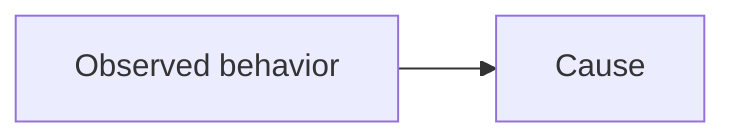
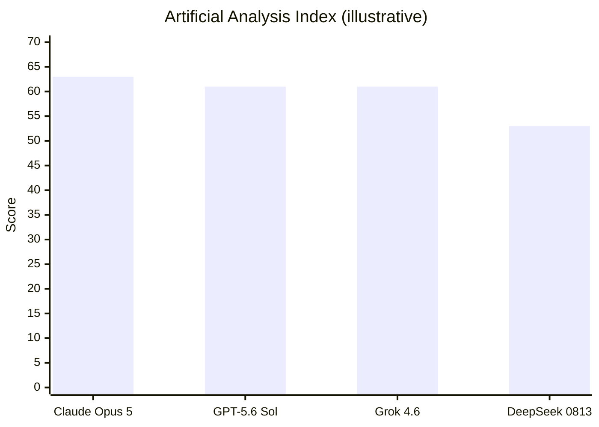

# NotionNext Article Capabilities

For new content, use only the intersection of:

1. blocks the Notion MCP can create through Notion-flavored Markdown; and
2. blocks this repository renders through `react-notion-x` or a verified custom component.

Renderer-only blocks are listed separately so existing content can be preserved without implying that the MCP can create those blocks.

The public article is not rendered from repository Markdown. Notion returns a `recordMap`, which `components/NotionPage.js` passes to `NotionRenderer`.

## Preferred blocks

Rich blocks support the causal narrative; they do not replace prose that identifies the actors, mechanism, checks, results, and relevant defenses.

### Headings

- Use `#`, `##`, and `###` in narrative order.
- Heading 4 is supported but should be rare.
- Keep no more than 6–8 top-level headings.
- Do not insert `<table_of_contents/>`; `lib/db/notion/getPageTableOfContents.js` builds the site TOC from headings.
- Avoid toggle headings for sections that must appear in the site TOC. A heading with child blocks can be omitted by the current TOC traversal.

### Callouts

```markdown
<callout icon="💡" color="blue_bg">
	One concise takeaway.
</callout>
```

Use for the opening scenario, a critical boundary, or one practical warning. Do not stack Callouts as ordinary paragraphs.

Do **not** put a lone `<br>` between Callout paragraphs. In this MCP → Notion path it often becomes a large empty gap. Write one paragraph, or indent a second child paragraph without `<br>`.

### Toggles

```markdown
<details color="gray_bg">
<summary>Why does this exception exist?</summary>
	Explanation with enough local context to stand alone.
</details>
```

Use for optional derivations, edge cases, or advanced variants. Indent children. Define every specialized term used inside the Toggle.

Same spacing rule as Callouts: no lone `<br>` spacers between Toggle children.

### Tables

Use Notion `<table>` syntax with `header-row="true"` for compact comparisons. Cells support rich text only, not nested lists, images, headings, or code blocks. Keep tables narrow enough for mobile layouts.

**Scannability rules for comparison tables:**

- One idea per cell. Never pack multiple models, scores, prices, or effort levels into one cell with semicolons or inline lists.
- Prefer one model (or one option) per row and one metric per score/price column.
- If a cell needs more than about one short phrase, move the detail to prose, a Toggle, or a chart caption.
- Tables answer "which / under what condition"; they do not replace a ranking chart when ≥3 comparable numbers are the point.

### Code and Mermaid

Use fenced code blocks with the exact language. Explain consequential lines in the narrative.

Mermaid is supported by `components/PrismMac.js` only when the code block produces the `language-mermaid` class. The site default CDN is Mermaid **11.4.0** (`conf/code.config.js`), which supports `flowchart`, `sequenceDiagram`, and `xychart-beta`.

````markdown

````

For multi-item numeric comparisons (benchmark scores, sample costs, latency), prefer a bar chart when axes stay simple:

````markdown

````

- Use lowercase `mermaid`.
- Keep one action per edge and quote labels containing punctuation.
- For security and other mechanistic flows, preserve the article's causal chain rather than combining distinct decisions into one edge.
- Put version, reasoning effort, date, and "what this score is not" in the caption or the paragraph immediately under the chart.
- If `xychart-beta` is too constrained (mixed currencies, many series, long labels), use a tracked SVG/PNG under `public/images/` with the same caption rules instead of stuffing numbers into a table cell.
- Always verify Mermaid charts on the public NotionNext route; Notion UI does not prove chart rendering.
- Do not rely on PlantUML auto-rendering; it remains a normal code block.

### Equations

- Inline: use the exact Notion-flavored form ``$`x^2`$``.
- Block: `$$` on separate lines.
- This repository uses KaTeX and loads `mhchem` for chemistry.
- Follow every important equation with a plain-language interpretation.

### Images and captions

```markdown

```

Images, captions, responsive display, and zoom are supported. Use reviewable diagrams rather than text-heavy generated images. Never persist a temporary Notion signed URL in article content.

### Quotes, lists, and checklists

Quotes, bulleted lists, numbered lists, and to-dos are supported. Use checklists for reader actions, not as a substitute for causal explanation.

### Columns

```markdown
<columns>
	<column ratio="50">
		Left content
	</column>
	<column ratio="50">
		Right content
	</column>
</columns>
```

Columns stack on narrow screens. Use them for short parallel comparisons; avoid wide tables, code, or databases inside columns.

## Supported enhanced blocks with extra risk

- **Embed / HTML artifact**: rendered by `components/NotionEmbed.js` in a sandboxed iframe. Use only when native blocks cannot express the interaction. Keep HTML artifacts at or below 512KB.
- **PDF, audio, video, and ordinary embeds**: supported, but verify source reachability and mobile layout.
- **Synced blocks**: normalized by the repository, but the source must be shared and reachable. Avoid for critical definitions.

## Renderer-only blocks

- **Notion Tabs**: `components/NotionTabs.js` renders existing Tabs, but the current MCP enhanced Markdown has no Tabs creation syntax. Preserve and preview existing Tabs; do not ask the MCP to create or convert them.
- **Inline databases and galleries**: existing blocks render, but the MCP article-writing path does not reliably create them and site configuration may disable links. Do not use them as the core narrative.
- **Bookmarks**: existing cards render through `react-notion-x`, but the current MCP Markdown surface does not guarantee creation of a bookmark card. Prefer a descriptive link.

## Avoid

- `link_preview` or newly released block types without repository evidence;
- PlantUML when a rendered diagram is expected;
- manual TOC blocks or outline screenshots;
- Notion child pages as the public article hierarchy;
- unshared synced-block sources;
- oversized HTML artifacts;
- temporary signed asset URLs;
- deep columns containing wide or interaction-critical content;
- arbitrary decorative colors that carry semantic meaning without text.

## Preview gate

Notion UI correctness is not enough. Before publication, use an `Invisible` page and verify the actual NotionNext route:

- heading TOC and anchor scrolling;
- mobile stacking and table overflow;
- light and dark themes;
- Mermaid and equations;
- code copy and wrapping;
- Toggle containment;
- image captions and zoom;
- Embed height and loading;
- internal and companion links.
